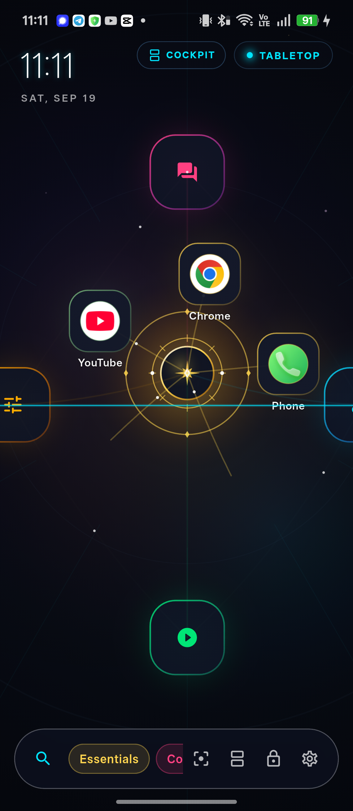
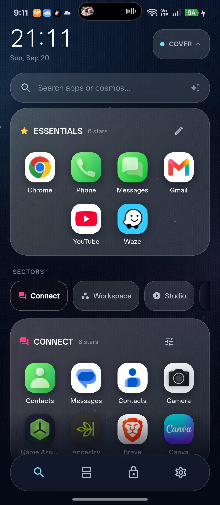
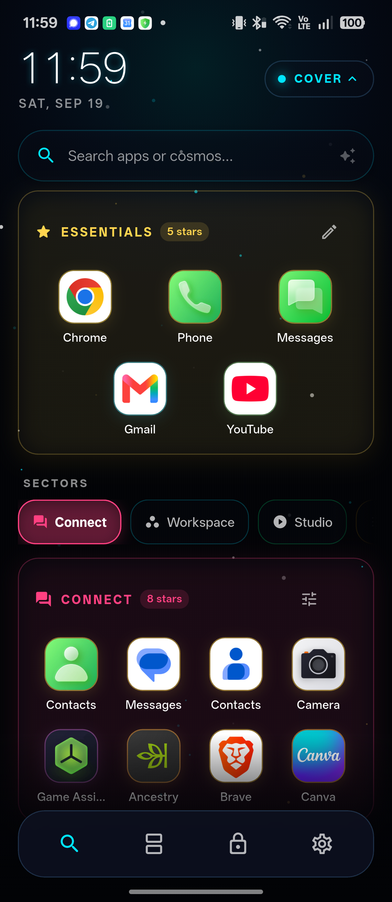
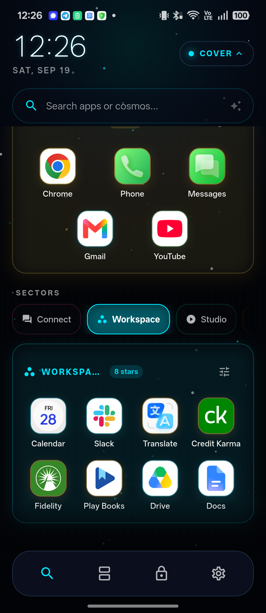

# ChronoFold

A personal Android launcher for foldable ColorOS hardware, built with Flutter. ChronoFold replaces the stock home screen with an interactive, camera-navigable constellation of your installed apps that responds to touch and to the physical posture of the device (folded, unfolded, and tabletop).

It is designed to be dependable enough for daily use as your default HOME app, while keeping a distinctive, animated way to browse and launch apps.

## Highlights

- **Kinetic galaxy canvas** — apps live as nodes in a constellation you pan, zoom, and fling around with inertia, centered on a glowing star.
- **Fold-aware layouts** — folded cover screen, unfolded galaxy, and a tabletop cockpit mode, all adapting to the hinge sensor so it feels like one product across postures.
- **Constellations & sectors** — group apps into named, color-coded constellations (Essentials, Connect, Workspace, Studio, and your own), each editable in place.
- **Cosmic lock screen** — an optional launcher-owned lock surface with clustered app orbs and quick shortcuts. Authentication always delegates to the Android keyguard.
- **App & web search** — search installed apps or escalate a miss to the comet web-search surface without retyping.
- **Live wallpaper hand-off** — hands off to Android's live-wallpaper chooser for an ambient cosmic backdrop.
- **Accessibility-minded** — 48 dp touch targets, TalkBack semantics on painted app nodes, scalable text, safe-area handling, and support for the system "reduce motion" preference.

## Screenshots

### Galaxy constellation (unfolded)
Apps orbit a central star. Pan, zoom, and fling to navigate; toggle Cockpit and Tabletop modes from the top.



### Luminous home & sectors
A calmer home surface with an Essentials group and switchable sectors (Connect, Workspace, Studio).



### Cover screen (folded)
The compact cover layout used when the device is folded, with search, sectors, and the bottom cockpit bar.



### Cosmic lock screen
An optional launcher lock surface. Tap an app to launch, swipe up to enter. The Android keyguard still owns authentication.



## Architecture

ChronoFold is a Flutter app with a thin native Android layer for launcher-specific system integration.

```
lib/
  main.dart              App entry, home screen orchestration, lifecycle & HOME wiring
  models/                App entries and constellation data models
  core/                  Launcher bridge, foldable controller, galaxy layout engine,
                         search coordination, and persisted galaxy storage
  canvas/                Camera controller and the interactive galaxy canvas
  ui/                    Screens (folded cover, tabletop cockpit), widgets, and theme
  features/lockscreen/   Cosmic lock screen
android/app/             Native launcher integration (HOME role, package queries,
                         keyguard, hinge sensor, app-return bridge, wallpaper preview)
```

Key pieces:

- **LauncherBridge** — the platform channel to Android: querying and launching installed apps, HOME/screen lifecycle events, default-launcher status, keyguard overlay control, and the live-wallpaper preview.
- **FoldableController** — reads posture (folded / unfolded / tabletop) and drives layout switching.
- **CameraController** — pan, zoom, and inertial motion for the galaxy canvas.
- **GalaxyLayoutEngine** — assigns apps to constellations, tracks core/hidden packages, custom constellations, and per-constellation overrides.
- **GalaxyStorageService** — persists your constellation configuration and native-lock preference.

### Lock screen modes

- **Cosmic (default)** — a screen-off event mounts ChronoFold's own lock surface. Authentication still passes through the platform keyguard before anything is revealed or launched.
- **Native** — ColorOS owns the secure keyguard directly; ChronoFold does not mount its lock surface.

## Getting started

Requirements:

- Flutter SDK (Dart SDK `^3.13.1`)
- An Android device or emulator (the launcher targets ColorOS foldable hardware but runs on standard Android)

Install dependencies and run:

```bash
flutter pub get
flutter run
```

Build a release APK:

```bash
flutter build apk --release
```

To use ChronoFold as your home screen, install it and set it as the default launcher (the home HUD offers a "Set default" action when it is not the current HOME app).

## Testing

```bash
flutter test
```

## Design boundaries

- ColorOS-inspired hybrid visual language, not an exact ColorOS clone.
- No root access, SystemUI hooks, or private ColorOS APIs.
- No unlicensed OEM fonts, icons, wallpapers, or sounds; every visual asset must be original or clearly permitted for redistribution.
- Android owns security-critical experiences (keyguard, wallpaper chooser).

See [PRODUCT.md](PRODUCT.md) for the full product definition and principles.
